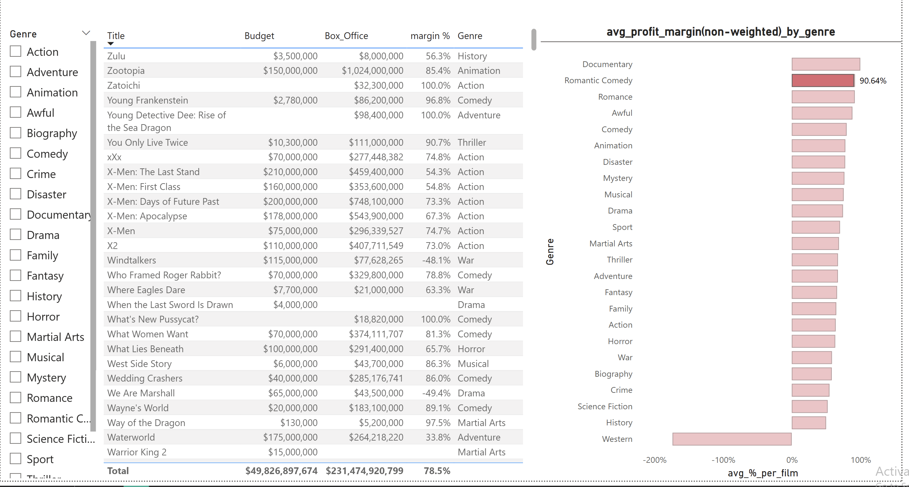
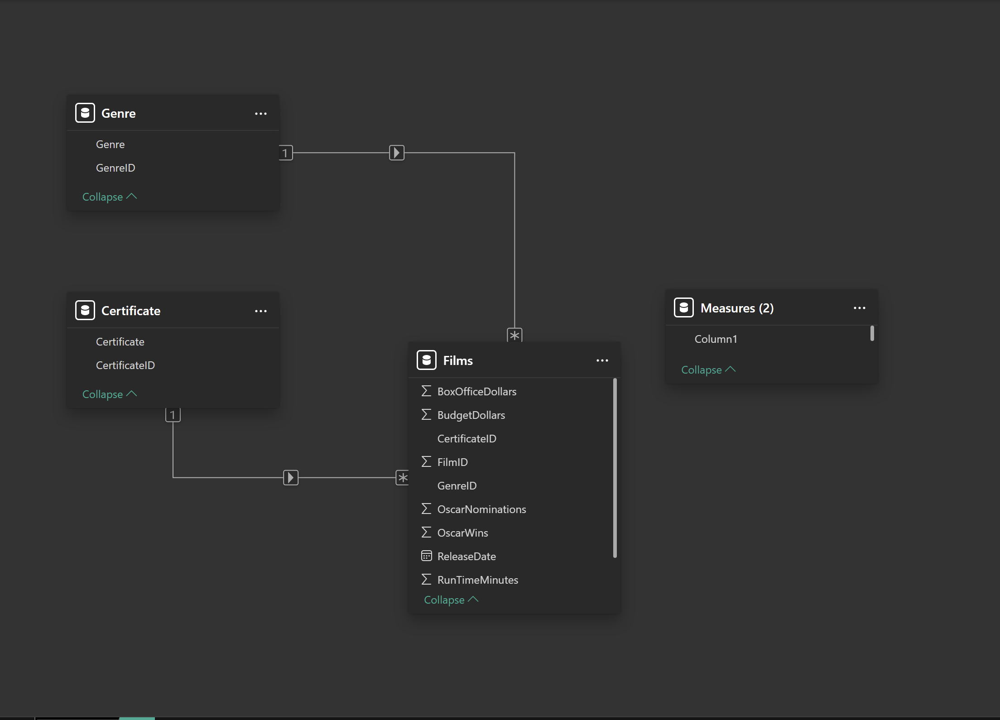

# 🎬 Power BI – Films DAX Challenge

## Dashboard Preview

## Data Model

This project is a Power BI dashboard built to analyze movie profitability using DAX measures
and a clean relational data model.

The objective of this project is to understand how filter context, data quality,
and aggregation logic impact business metrics, with a particular focus on the difference
between weighted and unweighted profit margin calculations.

---

## 📊 Project Overview

The main goals of this project are:

- Build a proper fact and dimension data model in Power BI
- Practice writing explicit DAX measures instead of relying on implicit aggregations
- Calculate profitability using clear business logic
- Compare revenue-weighted profitability with per-movie average profitability
- Handle missing data correctly at the data preparation stage
- Design an interactive dashboard with controlled slicer interactions

---

## 📂 Data Model & Structure

### Tables Used

- Films (Fact table)
  - Budget
  - Box Office revenue

- Genre (Dimension table)
- Certificate (Dimension table)

### Relationships

- Genre → Films (one-to-many)
- Certificate → Films (one-to-many)
- Single-direction filtering (best practice)

This data model ensures correct filter propagation from dimension tables to the fact table
and prevents misleading aggregations in DAX calculations.

---

## 🧠 Key DAX Measures

### Weighted Profit Margin (%)

Margin % =
VAR revenue =
    SUM ( Films[BoxOfficeDollars] )
VAR margin =
    revenue - SUM ( Films[BudgetDollars] )
RETURN
DIVIDE ( margin, revenue )

Explanation:
This measure calculates the overall profitability of a selected group of movies by comparing
total box office revenue with total budget.

Movies with higher box office revenue have a larger impact on the final result,
which makes this a revenue-weighted profitability metric.

This measure answers the following question:

“How profitable is this group overall, taking revenue size into account?”

---

### Unweighted Average Profit Margin per Movie

Avg Margin % per Movie =
AVERAGEX (
    VALUES ( Films[Title] ),
    [Margin %]
)

Explanation:
This measure calculates the profit margin for each movie individually and then computes
the average of those margins.

Each movie contributes equally to the final value, regardless of its box office size.
As a result, this measure represents an unweighted average profitability metric.

This measure answers the following question:

“On average, how profitable is a single movie in this group?”

---

## ⚠️ Handling Missing Data

During the analysis, some movies were found to have missing Budget or Box Office values.

Instead of masking the issue using conditional logic inside DAX measures:

Rows with missing Budget or Box Office values were removed in Power Query

This approach ensures:
- Profitability metrics remain meaningful
- DAX logic stays clean and interpretable
- No misleading results caused by incomplete or invalid data

---

## 📈 Dashboard Overview

The final Power BI dashboard includes the following visuals:

Genre Slicer:
- Filters the certificate slicer and the main table
- Does not affect the bar chart (controlled interaction)

Certificate Slicer:
- Filters all visuals on the page

Main Table (Per Movie):
- Total Budget (M$)
- Total Box Office (M$)
- Profit Margin (%)

Bar Chart:
- Profit margin summarized by Genre

Filter interactions were explicitly configured according to the challenge requirements
to control how slicers affect each visual.

---

## 📈 Key Learnings

- Difference between implicit and explicit measures in Power BI
- Proper use of VAR for readable and maintainable DAX formulas
- Why AVERAGEX is required for unweighted average calculations
- Difference between weighted and unweighted profitability metrics
- Importance of data quality in analytical projects
- Understanding filter context and relationship-driven calculations

---

## 🛠 Tools Used

- Power BI Desktop
- DAX
- Power Query

---

## 🖼 Screenshots

Dashboard and data model screenshots are available in the screenshots folder.

---

## 🏷 Topics / Hashtags

Power BI · DAX · Business Intelligence · Data Analytics · Data Modeling ·
Profitability Analysis · Dashboard Design · Portfolio Project
